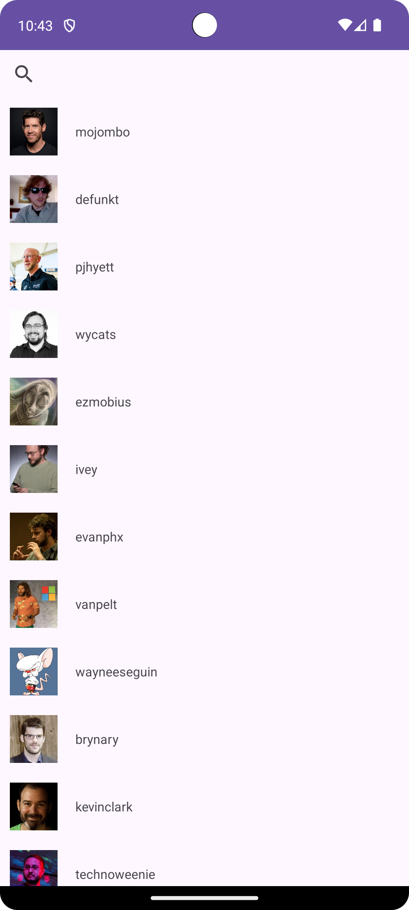
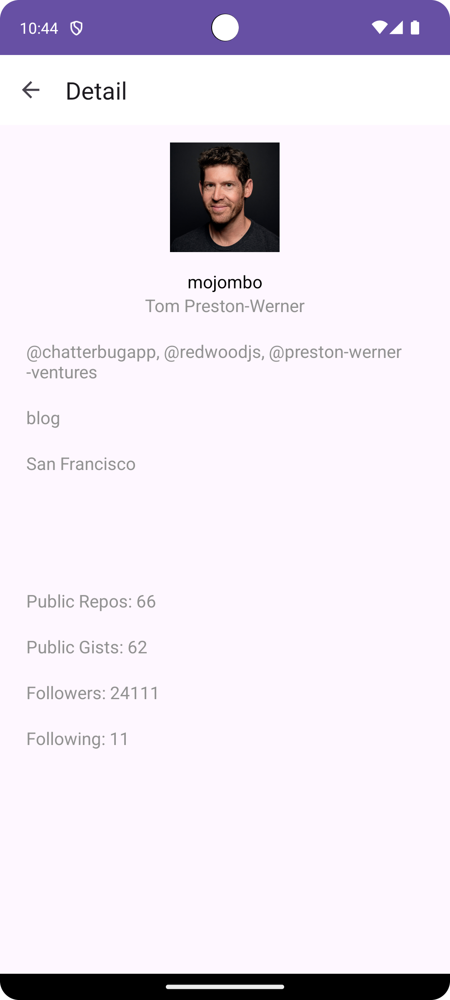

## Features

- **Github User Search**: Search for Github users by username.
- **Github User List**: View a list of Github users.
- **User Details**: View detailed information about a user.

## Screenshots

| Screenshot 1 | Screenshot 2 |
|--------------|--------------|
|  |  |

## Technologies Used

- **Programming Language**: Kotlin
- **Architecture**: MVVM (Model-View-ViewModel)
- **UI**: ConstraintLayout, RecyclerView
- **Dependency Injection**: Dagger Hilt
- **Data Management**: Room Database, LiveData
- **Networking**: Retrofit
- **Testing**: JUnit, Espresso

## Installation

1. Clone the repository:
   ```bash
   git clone https://github.com/rfaturriza/HCS-IDN.git
   ```

2. Open the project in **Android Studio**.

3. Sync the Gradle files.

4. Run the app on your emulator or physical device.

## Requirements

- Android Studio Bumblebee or higher
- Minimum SDK: 21 (Android 5.0)
- Kotlin 1.8 or higher

## License

This project is licensed under the MIT License. See the [LICENSE](LICENSE) file for details.

## Contact

For inquiries or support, reach out to:  
**Rizz Faturriza**  
📧 Email: [rfaturriza.dev@gmail.com](mailto:rfaturriza.dev@gmail.com)  
🌐 Website: [rfaturriza.my.id](http://rfaturriza.my.id)